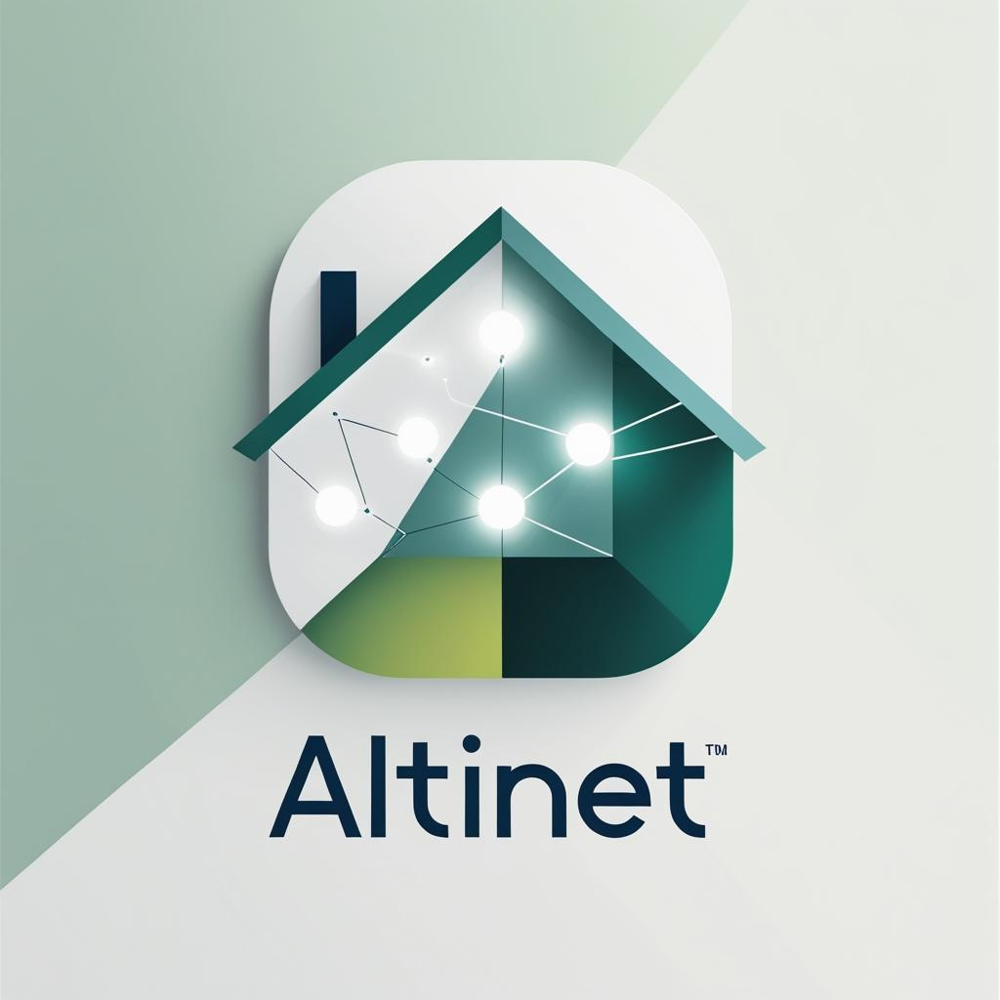

# altinet

<p align="center">
  
</p>

An AI assistant using computer vision to contextualise and interpret the world.

This repository currently contains a skeleton implementation. See
[docs/ARCHITECTURE.md](docs/ARCHITECTURE.md) for a description of the project
layout and intended components.

## Installation

The repository includes a helper script for setting up a Python virtual
environment and installing the required packages. The script checks for
Python 3.10 and installs it on Debian-based systems if necessary:

```bash
./install.sh
```

This creates a `.venv` directory with the dependencies listed in
`requirements.txt`. Activate the environment with:

```bash
source .venv/bin/activate
```
If Blender is installed, `install.sh` will also generate a basic floorplan at `assets/floorplans/basic_floorplan.blend`. To regenerate the floorplan manually run:

```bash
blender -b -noaudio --python scripts/generate_floorplan.py -- \
  --out assets/floorplans/basic_floorplan.blend \
  --width 10 --depth 8 --wall_height 3 --wall_thickness 0.2
```


Alternatively, use `make floorplan` to regenerate the file.
## ROS 2 Workspace


 
Altinet is organised as a ROS 2 workspace. Ensure you have a ROS 2
installation and the `colcon` build tool available. The computer vision
nodes also rely on OpenCV and `cv_bridge`; face recognition requires the
optional `face_recognition` Python package.

To build and run the included example nodes:
=======

Altinet is organised as a ROS 2 workspace. To build and run the included
example node:
 
 

```bash
colcon build
source install/setup.bash
ros2 run altinet minimal_node


 
# publish images from the default camera
ros2 run altinet camera_node
# detect faces in the image stream
ros2 run altinet face_detector_node
# attempt to identify detected faces
ros2 run altinet face_identifier_node

```

OpenCV Haar cascade XML files for face and eye detection are available in
`assets/haarcascades`. If your OpenCV build does not include these files,
pass their location to `face_detector_node`:

```bash
ros2 run altinet face_detector_node --ros-args -p \
  cascade_path:=assets/haarcascades/haarcascade_frontalface_default.xml
```

The path may be absolute or relative to the repository root.


 
## Local Node GUI

A minimal Django-based GUI is available for running a local Altinet node.
It now includes a simple map editor for placing nodes around your home and a
live view that reports basic environmental information. On startup the node
connects to your home Wi-Fi and creates an isolated "Altinet" access point for
other devices. Provide the necessary network details through environment
variables before launching the server:

```bash
export ALTINET_HOME_WIFI_SSID="<home-ssid>"
export ALTINET_HOME_WIFI_PASSWORD="<home-password>"
export ALTINET_AP_SSID="Altinet"
export ALTINET_AP_PASSWORD="altinetpass"
```

To launch the development server:

```bash
python -m altinet.localnode.startup
```

To view and manage Wi-Fi connections directly, a simple network console can be
launched with:

```bash
python -m altinet.core.network
```

By default the server binds to `127.0.0.1:8000`. You can override the host
and port by passing arguments to `start_server`.
