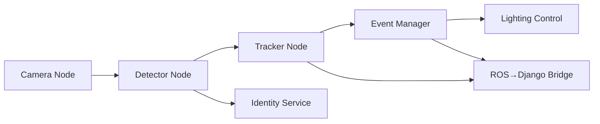

# Altinet Perception Stack

## What changed

- Replaced the face-oriented prototype with a room-centric perception
  stack built on ROS 2 nodes.
- Added YOLOv8n ONNX inference, ByteTrack-based tracking, event
  management, lighting control, and a ROS→Django bridge.
- Documented the architecture and generated API docs via `pdoc`.

## Pipeline overview

### Detector

`DetectorNode` loads YOLOv8n from `assets/models/yolov8n.onnx`, filters to
person detections, and publishes `altinet/PersonDetections`.

### Identity Service

`IdentityNode` exposes `/altinet/check_person_identity`, using bounding box
size and detector confidence to distinguish residents from guests. The
detector queries the service asynchronously for each detection and logs the
resolved identity alongside the bounding box coordinates.

### Tracker

`TrackerNode` wraps a ByteTrack-inspired tracker that maintains stable
IDs. It publishes `altinet/PersonTracks` for downstream consumers.

### Event Manager

The event manager derives ENTRY/EXIT/POSITION_CHANGE events and publishes
room presence summaries. Calibration is loaded from
`assets/calibration/<room>.json` when available.

### Lighting Control

Lighting rules toggle rooms based on occupancy and support manual
overrides via `/altinet/manual_light_override`.

### ROS→Django Bridge

The bridge forwards events, presence and track updates to the Django
backend using WebSocket when available, falling back to REST with
exponential backoff.

## Running docs

Use `make docs` to regenerate API documentation under `docs/api/`.
